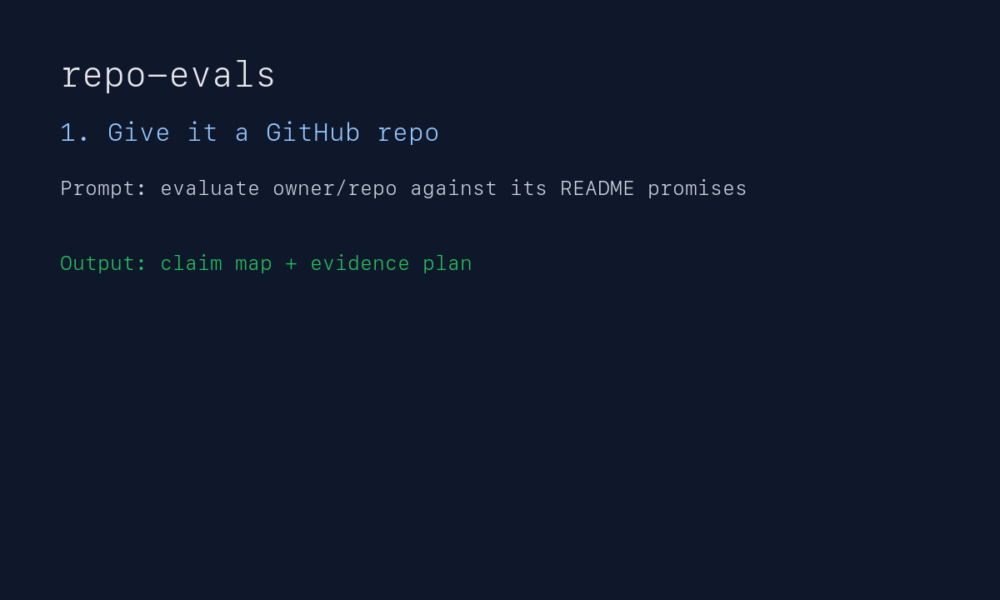
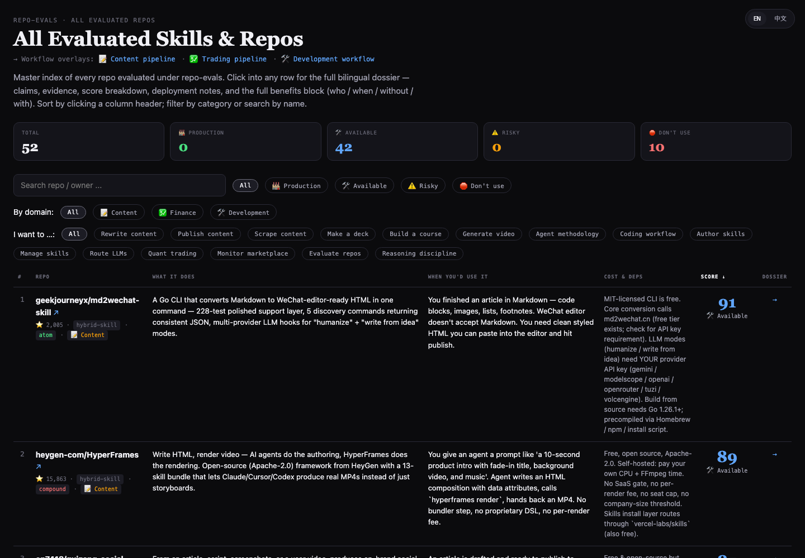
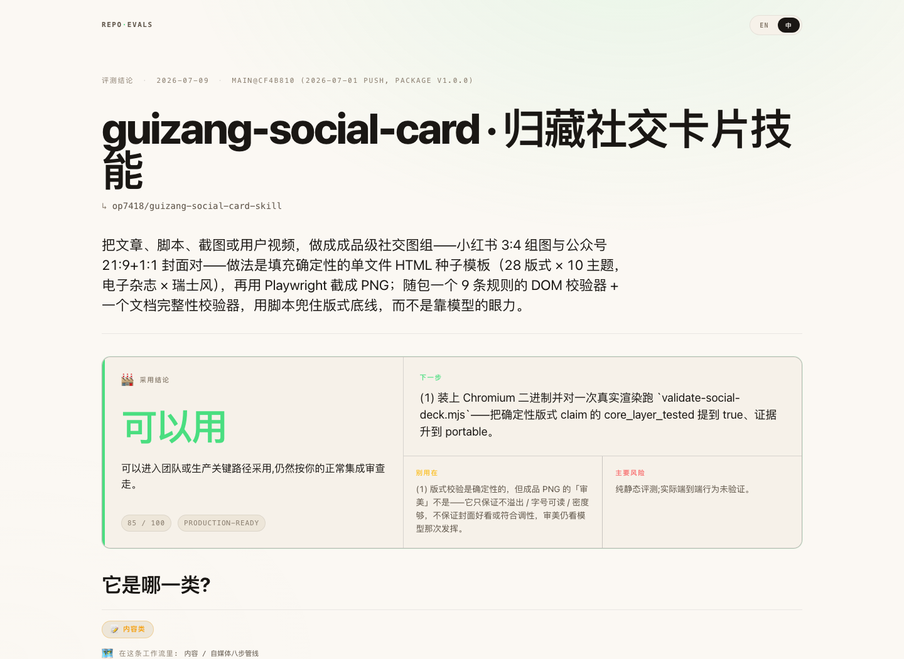
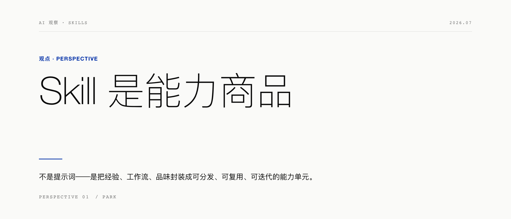
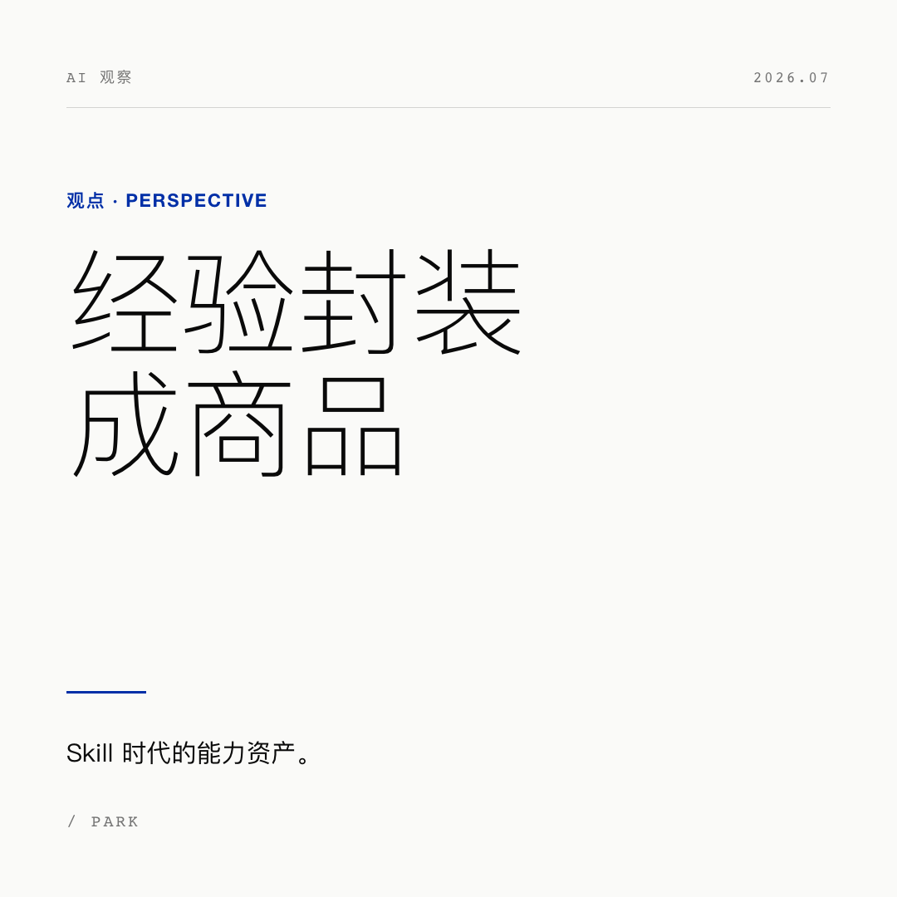
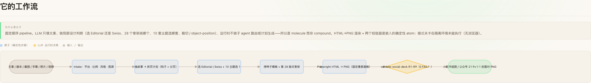

<div align="center">

# repo-evals

**Claim-first 仓库评测框架 — 把"这个 skill / repo 到底能不能用"变成一份可审计、可对比的双语 dossier。**

[](https://www.python.org/)
[](SKILL.md)
[](https://skills.sh/zinan92/repo-evals)
[](docs/FRAMEWORK.md)
[](docs/VERDICT-CALCULATOR.md)
[](docs/VERDICT-CALCULATOR.md)
[](docs/LAYERS.md)
[](tests/)
[](LICENSE)

### 👉 [Browse the live evaluated-repo catalog](https://zinan92.github.io/repo-evals/) · [浏览已评测仓库目录](https://zinan92.github.io/repo-evals/)

</div>

---

```
in   target repo (owner/repo) + handwritten claim-map.yaml
out  bilingual dossier with:
       - 0-100 auditable score (6-component breakdown)
       - 4-category band: 🏭 Production · 🛠 Available · ⚠️ Risky · 🛑 Don't use
       - layer (atom · molecule · compound) + workflow SVG diagram
       - benefits cards: persona · scenario · without · with · cost · examples
       - similar-repos comparison drawn from this corpus (no web search)
     plus a master dashboard indexing the entire corpus

fail  no claim-map.yaml          → render falls back to legacy fields
fail  similar slug not in corpus → comparison block stays empty (honest)
fail  static-only eval           → reader-facing category cannot outrank
                                   final bucket ceilings; Production needs
                                   score + live/core evidence
```

The framework is its own first user: **50+ repos already evaluated** under
this model; the current generated dashboard indexes **52 dossiers**. The score for any repo is auditable point-by-point — the
six named components (`base / static_eval / maintainer_evidence /
ecosystem / layer_bonus / penalties`) appear in every dossier, so a
reader who disagrees with a number can challenge that exact number.

Latest self-eval: the **2026-06-27 credibility pass** fixed archetype
scaffold YAML drift, added a logged live onboarding e2e, and the current
suite now runs at **155 passing tests**.



<sub>Demo source: [`assets/repo-evals-demo.tape`](assets/repo-evals-demo.tape). Current self-eval: [`repos/zinan92--repo-evals/verdicts/2026-06-27-verdict.html`](repos/zinan92--repo-evals/verdicts/2026-06-27-verdict.html).</sub>

## What the output looks like

The public catalog is a sortable decision table, not a blog index. It lets you
scan score, category, cost/dependencies, layer, business domain, and the exact
dossier link for every evaluated repo.



Each dossier opens with the adoption verdict first: use / use with limits / hold
/ skip, then the next move, do-not-use boundary, and main risk. The audit trail
is still there, but it no longer competes with the answer.



For repos that generate images, text, HTML, slides, or other artifacts, the
dossier can put a real output sample near the top: first the repo title, then
the input summary, then the generated sample. This makes the report feel like
evidence instead of a technical write-up.

| WeChat 21:9 cover generated during eval | WeChat 1:1 share card generated during eval |
|---|---|
|  |  |

Sample manifest:
[`repos/op7418--guizang-social-card-skill/runs/2026-07-09/run-static-and-live-render/artifacts/manifest.yaml`](repos/op7418--guizang-social-card-skill/runs/2026-07-09/run-static-and-live-render/artifacts/manifest.yaml)

Workflow diagrams can fold into compact two-row layouts, so long molecule /
compound flows stay readable without making the reader discover hidden
right-side content.



## Install as an Agent Skill

```bash
npx skills add zinan92/repo-evals -g
```

Then ask your agent:

```text
Evaluate https://github.com/owner/repo against its README promises. Write the result in Chinese, and tell me whether I should adopt it.
```

Use this skill when you need to decide whether to install, depend on, fork,
recommend, or avoid a repo. It is strongest when the target repo has a README,
install path, visible claims, or a SKILL.md to compare against real files.

Example runbook: [`examples/quickstart.md`](examples/quickstart.md).

## 示例输出

A rendered dossier flows top-to-bottom in priority order:

1. **Hero** — repo name + one-line value statement
2. **Actual output sample** — for generation repos: input summary → generated image/text/HTML artifact
3. **Adoption verdict** — use / use with limits / hold / skip, next move, do-not-use boundary, main risk
4. **Layer + domain** — atom / molecule / compound, business category, workflow placement
5. **Usability score** — 4-category score strip, checked-vs-missing evidence
6. **Benefits** — who, when, how, before/after, concrete invocation examples
7. **Workflow** — readable SVG diagram; long workflows fold instead of shrinking
8. **Similar repos** — comparison drawn only from this committed corpus
9. **Audit trail** — deployment/cost, claim ledger, score breakdown, run logs, raw verdict archive

Live samples to read:

- [`repos/obra--superpowers/verdicts/2026-05-05-verdict.html`](repos/obra--superpowers/) — compound (tree workflow)
- [`repos/NanmiCoder--MediaCrawler/verdicts/`](repos/NanmiCoder--MediaCrawler/) — molecule (linear pipeline)
- [`repos/zarazhangrui--frontend-slides/verdicts/`](repos/zarazhangrui--frontend-slides/) — atom (input → output)
- [`repos/op7418--guizang-social-card-skill/verdicts/2026-07-09-verdict.html`](repos/op7418--guizang-social-card-skill/verdicts/2026-07-09-verdict.html) — redesigned verdict with long workflow
- [`repos/zinan92--repo-evals/verdicts/`](repos/zinan92--repo-evals/) — the framework's self-eval
- [`dashboard/all-evals.html`](dashboard/all-evals.html) — sortable master index

## Score model — 6 auditable components

| Component | Range | What it measures |
|---|---|---|
| **base** | +40 | "the project is real, not archived, has a license" |
| **static_eval** | ±30 | claim-by-claim outcomes (passed / failed / untested) |
| **maintainer_evidence** | +0 to +15 | release pipeline, eval discipline, recent activity |
| **ecosystem** | +0 to +12 | GitHub stars (capped — peer validation, not popularity) |
| **layer_bonus** | −3 to +5 | atom +5, molecule +0, compound −3 (static eval can't validate runtime branches) |
| **penalties** | varies | LICENSE missing, privacy concerns, archived repo |

Sum is clamped to 0–100 and dropped into one of 4 categories:

| Category | Range | Meaning |
|---|---|---|
| 🏭 **Production-ready** | 80+ | Safe to depend on in team / production pipelines |
| 🛠 **Available** | 50–79 | Use it; not yet for production-critical paths |
| ⚠️ **Risky** | 30–49 | Runs but has unverified critical issues |
| 🛑 **Don't use** | <30 | Won't install / core feature broken / archived |

Range is the raw score band. The reader-facing category is also capped by the
final bucket, so hard ceilings still win: a score of 80 with `final_bucket:
usable` renders as 🛠 Available, not 🏭 Production-ready.

## Layer model — atom · molecule · compound

| Layer | What it means | Visualisation |
|---|---|---|
| **atom** | Single user-facing capability with deterministic internal phases | input → atom → output |
| **molecule** | Fixed pipeline of atoms (LLM doesn't decide next step at runtime) | left-to-right pipeline diagram |
| **compound** | LLM decides at runtime which atom/molecule fires next | top-down tree with diamond LLM-decision nodes |

The dossier explicitly explains *why* a given repo is at its layer
(e.g., why a methodology bundle is compound and not molecule). See
[`docs/LAYERS.md`](docs/LAYERS.md) for the long form.

## Quick start

```bash
git clone https://github.com/zinan92/repo-evals.git
cd repo-evals
python3 -m pip install pyyaml

# 1. Scaffold a new evaluation
scripts/new-repo-eval.sh owner/some-skill skill

# 2. Hand-author the claim map
# $EDITOR repos/owner--some-skill/claims/claim-map.yaml
# (write 6-10 claims; mark statuses as you verify each)

# 3. Fill repo.yaml product_view (persona / scenario / without / with /
#    cost_summary / examples) + workflow_diagram + similar_repos
# $EDITOR repos/owner--some-skill/repo.yaml

# 4. Render the bilingual dossier and refresh the master dashboard
python3 scripts/publish_eval.py owner--some-skill --lang zh
```

If the target repo generates visible output, save at least one real sample under
the eval run and add an artifact manifest:

```text
repos/<slug>/runs/<date>/<run>/artifacts/
├── manifest.yaml           # input summary + generated outputs + validation notes
├── sample-output.png       # or .md / .html / .gif / .mp4
└── ...
```

`render_verdict_html.py` reads that manifest and places the sample high in the
verdict page, immediately after the title.

GitHub Pages serves committed static files. After adding or changing evals,
run `python3 scripts/publish_eval.py <slug> --lang zh` before pushing; otherwise
the live `dashboard/all-evals.html` catalog will stay stale even though
`repos/*` changed. Direct calls to `render_verdict_html.py <slug>` also refresh
the master dashboard by default; use `--no-dashboard` only inside batch jobs.
After changing the shared HTML template, run
`python3 scripts/publish_eval.py --all --lang zh` to regenerate every dossier
and rebuild the dashboard once.

## 标准流程 (架构)

```
┌──────────────┐    ┌──────────────┐    ┌──────────────┐    ┌──────────────┐    ┌──────────────┐
│ 1. scaffold  │───▶│ 2. claim-map │───▶│ 3. static    │───▶│ 4. verdict   │───▶│ 5. render +  │
│ (new-repo)   │    │  (6-10 claims │    │    checks    │    │  calculator  │    │   dashboard  │
│              │    │   per repo)   │    │              │    │  (0-100 +    │    │              │
│              │    │              │    │              │    │   category)  │    │              │
└──────────────┘    └──────────────┘    └──────────────┘    └──────────────┘    └──────────────┘
```

The pipeline is fully deterministic from step 3 onward — the labour
cost lives in step 2 (authoring a thoughtful claim-map, ~30-60 min
per repo). Step 1 + 5 are tooling, step 3 is the human verifying
each claim against the actual repo.

## Trigger Phrases

- "评测一下这个 repo，看看能不能依赖"
- "eval 这个 skill，给我 adoption verdict"
- "这个 GitHub 项目 README 说的是真的吗?"
- "Compare these two repos and tell me which one is safer to adopt"
- "Audit this repo's claims vs reality and render a dossier"

## What the new dossier surfaces

Every dossier renders these blocks in priority order when the underlying data exists:

1. **Hero** — repo name + slug + one-line tagline
2. **🖼 Output samples** — generated images/text/HTML when `artifacts/manifest.yaml` exists
3. **Adoption verdict** — use / use with limits / hold / skip, next move, do-not-use boundary, main risk
4. **🔬 Layer strip** — 3-card spectrum (atom · molecule · compound), current highlighted
5. **📊 Category strip** — 4-zone score bar with a tick at the actual score
6. **✨ Benefits** — 4 cards (persona / scenario / without / with) + 3 concrete usage examples each (context + actual quote + what happens)
7. **🛠 Workflow diagram** — self-contained SVG, folded/linear/tree layouts matching the layer
8. **🔍 Similar repos** — comparison cards drawn from this corpus only; live scores via `verdict_calculator`. No web search.
9. Deployment + cost surface, watch-outs, claim ledger, score breakdown (collapsible)

## Tools

| Script | What it does |
|---|---|
| `scripts/new-repo-eval.sh <owner/repo>` | Scaffold a new evaluation directory |
| `scripts/extract_claims.py <target>` | Draft a claim-map from README/SKILL.md (every claim marked `needs_review: true`) |
| `scripts/coverage_gap_detector.py <slug>` | Surface critical / warning / info gaps in claim coverage |
| `scripts/verdict_calculator.py <verdict-input.yaml>` | Compute a verdict recommendation from a structured input file |
| `scripts/render_verdict_html.py <slug>` | Render the bilingual HTML dossier |
| `scripts/publish_eval.py <slug>` / `--all` | Render dossier(s), then refresh `dashboard/all-evals.html` |
| `scripts/build_master_dashboard.py` | Rebuild `dashboard/all-evals.html` master index |
| `scripts/reeval_diff.py <slug>` | Structured diff between two evals of the same repo |

## Safety Boundaries

- It does not install or run untrusted target repos on your live system by default.
- It treats source inspection, GitHub API metadata, isolated subprocesses, and saved artifacts as preferred evidence.
- It does not treat GitHub stars, README badges, or passing CI as proof of user value.
- If a claim needs credentials, private data, browser profiles, or risky local state, mark it untested and surface the ceiling instead of bypassing safety.
- The rendered verdict is a decision aid, not a guarantee; bad claim maps still produce bad scores.

## For AI agents

```yaml
name: repo-evals
capability:
  summary: Claim-first repository evaluation harness producing 0-100 scores + bilingual dossiers
  in: target repo (owner/repo) + handwritten claim-map.yaml + repo.yaml product_view
  out: bilingual HTML dossier + master dashboard entry
  fail:
    - "no claim-map → render falls back to legacy product_view fields"
    - "similar slug not in corpus → comparison stays empty (honest stub)"
    - "static-only eval → reader-facing category capped by final bucket ceilings"
    - "sample manifest missing → output sample section is omitted, not fabricated"
cli_commands:
  - cmd: scripts/new-repo-eval.sh
    args: ["<owner/repo>", "[skill|tool|framework]"]
  - cmd: scripts/render_verdict_html.py
    args: ["<owner--repo>"]
  - cmd: scripts/publish_eval.py
    args: ["<owner--repo>", "--lang", "zh"]
  - cmd: scripts/verdict_calculator.py
    args: ["repos/<owner--repo>/verdicts/<date>-verdict-input.yaml"]
  - cmd: scripts/build_master_dashboard.py
    args: []
artifacts:
  claim_map: repos/<slug>/claims/claim-map.yaml
  sample_manifest: repos/<slug>/runs/<date>/<run>/artifacts/manifest.yaml
  repo_yaml: repos/<slug>/repo.yaml
  verdict_md: repos/<slug>/verdicts/<date>-final-verdict.md
  dossier_html: repos/<slug>/verdicts/<date>-verdict.html
  dashboard: dashboard/all-evals.html
score_components: [base, static_eval, maintainer_evidence, ecosystem, layer_bonus, penalties]
categories: [production, available, risky, dont_use]
layers: [atom, molecule, compound]
```

```python
import subprocess

# Evaluate a new repo
subprocess.run(
    ["scripts/new-repo-eval.sh", "owner/some-skill", "skill"],
    cwd="/path/to/repo-evals", check=True,
)

# After a human authors claim-map + repo.yaml, render the dossier and dashboard
subprocess.run(
    ["python3", "scripts/publish_eval.py", "owner--some-skill", "--lang", "zh"],
    cwd="/path/to/repo-evals", check=True,
)
```

## 相关项目

The framework was used to evaluate itself — see
[`repos/zinan92--repo-evals/verdicts/`](repos/zinan92--repo-evals/) for
the historical meta-eval and the 2026-06-27 credibility pass. The first
self-eval caught real defects (no LICENSE before this README, README was
stale before this README); the latest pass records the fixes plus a live
onboarding e2e artifact.

A handful of representative evaluated peers:

| Repo | Layer | Category | Score | Where the dossier sits |
|---|---|---|---|---|
| obra/superpowers | compound | 🛠 Available | 77 | [link](repos/obra--superpowers/verdicts/) |
| NanmiCoder/MediaCrawler | molecule | 🛠 Available | 75 | [link](repos/NanmiCoder--MediaCrawler/verdicts/) |
| anthropics/skill-creator | molecule | 🛠 Available | 81 | [link](repos/anthropics--skill-creator/verdicts/) |
| op7418/guizang-social-card-skill | molecule | 🛠 Available | 85 | [link](repos/op7418--guizang-social-card-skill/verdicts/2026-07-09-verdict.html) |
| zarazhangrui/frontend-slides | atom | 🛠 Available | 62 | [link](repos/zarazhangrui--frontend-slides/verdicts/) |
| zinan92/content-downloader | molecule | 🛑 Don't use | 44 | [link](repos/zinan92--content-downloader/verdicts/) |

Full sortable / filterable list: [`dashboard/all-evals.html`](dashboard/all-evals.html).

## 文档

- [FRAMEWORK.md](docs/FRAMEWORK.md) — Full framework definition
- [VERDICT-CALCULATOR.md](docs/VERDICT-CALCULATOR.md) — Score model + tier/category mapping
- [LAYERS.md](docs/LAYERS.md) — atom · molecule · compound classification rules
- [ARCHETYPES.md](docs/ARCHETYPES.md) — 7 repo archetypes (pure-cli, prompt-skill, hybrid-skill, adapter, orchestrator, api-service, mcp-enhancement)
- [DASHBOARD.md](docs/DASHBOARD.md) — Master dashboard generation
- [REEVAL-DIFF.md](docs/REEVAL-DIFF.md) — Structured diffs between two evals
- [PROVENANCE.md](docs/PROVENANCE.md) — Evidence capture + provenance discipline
- [CLAIM-EXTRACTION.md](docs/CLAIM-EXTRACTION.md) — Conservative claim-map drafting
- [SAMPLE-COVERAGE-GAPS.md](docs/SAMPLE-COVERAGE-GAPS.md) — Current corpus gaps and next model improvements

## License

MIT — see [LICENSE](LICENSE).
